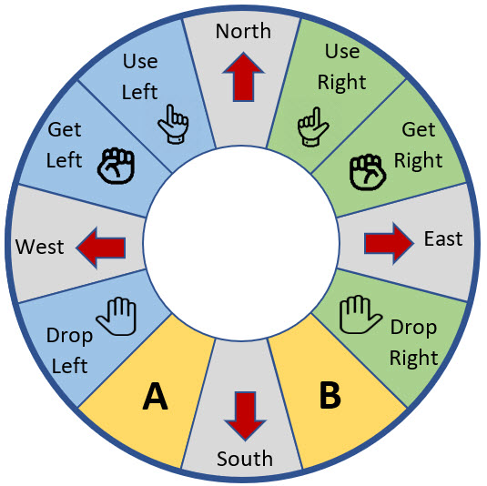
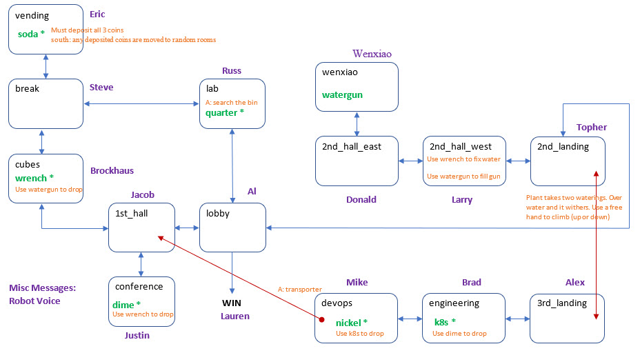

# Soda Machine

The price of the soda is 50 cents. A dime already is already in it. It takes
three coins (quarter, dime, nickel) to get the soda. When you leave
the room, any coins you put in the machine pop out and roll to nearby 
rooms. The trick is to drop a coin in this room then come back
with one coin in each hand. Use left, user right, get right, use right.

# Vertiv

# Prompts

## Misc (Robot Voice)

## lobby (Al)

## 1st\_hall (Jacob)

## conference (Justin)

## cubes (Brockhaus)

## break (Steve)

## vending (Eric)

## lab (Russ)

## 2nd\_landing (Topher)

## 2nd\_hall\_west (Larry)

## 2nd\_hall\_east (Donald)

## wenxiao (Wenxiao)

## 3rd\_landing (Alex)

## engineering (Brad)

Brad has the `kubelet` process. You need this to get the `nickel` from devops. Show brad the `dime`, and he'll give you the `kubelet` cluster.
Then Brad vanishes.

> **engDes.wav:** Welcome to engineering. All around you, you hear the frantic typing of software development. The 3rd floor
landing is to the WEST. This room continues to the EAST. 

> **engBrad.wav:** Brad Lanford is pacing nervously outside his cube and says, "I forgot my password! I know I used the name of the guy on the
dime, but what's his name? I can't remember!"

> **engShowDime.wav:** What have you got there? A DIME! Oh yeah ... "Roosevelt". How can I ever thank you? I know -- I have this extra Kubelet process. You are 
welcome to take it with you. Now if you'll excuse me, I'm off to play some foosball.

> **kubeletShort.wav:** Kubelet

> **kubeletDesc.wav:** There is a Kubelet process resting against the wall.

## devops (Mike)

## WIN (Lauren)

