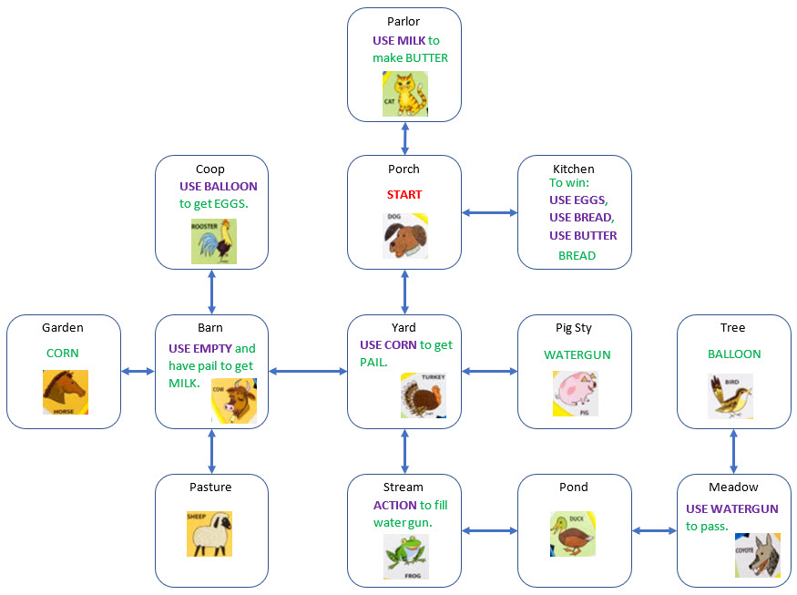

# The Farmer Cooks

Gary Dion's Audio Adventure Game on the Farmer Says

The ultimate goal is to make French Toast. The audio prompts include all 12 of the original animal: SHEEP, DOG, DUCK, FROG, HORSE, COYOTE, ROOSTER, PIG, COW, BIRD, CAT, TURKEY

Another audio adventure for the hardware:

[https://github.com/topherCantrell/vertiv-01-stovehouse-plans](https://github.com/topherCantrell/vertiv-01-stovehouse-plans)

