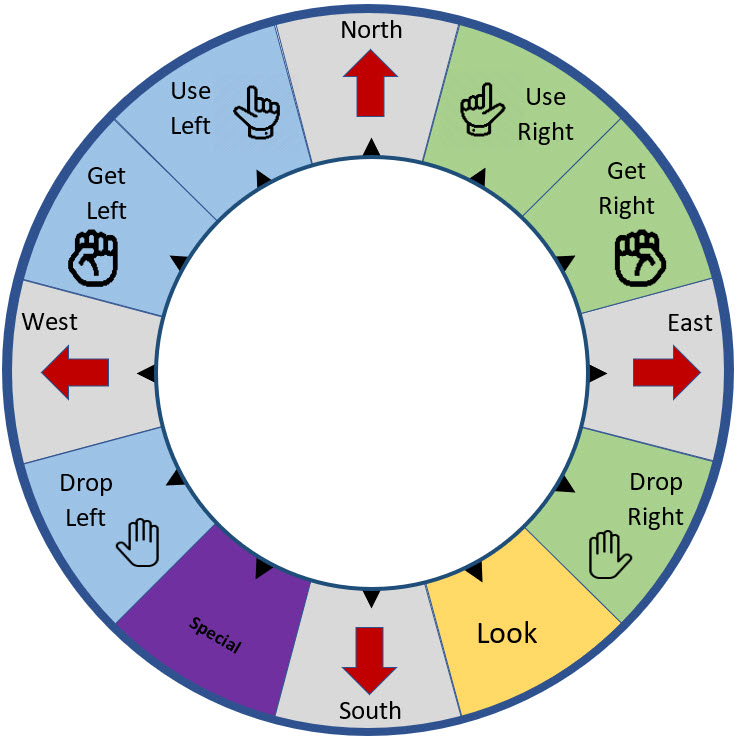
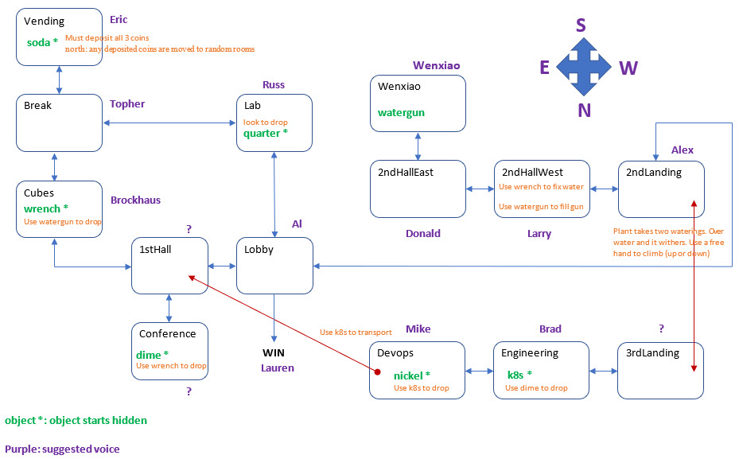

# The Vertiv Adventures -- Part 1: Stovehouse Plans

### As seen on Adafruit Show and Tell

https://youtu.be/x0ClwiR53TE?t=511

You are on an important mission! Patrick has given you the architectural drawings for the Stovehouse
floor-plan. You must get these plans to the workers at Stovehouse, but getting out of the building
proves to be a challenge.

[https://thoughtworlds.com](https://thoughtworlds.com)

Another audio adventure for the hardware:

[https://github.com/topherCantrell/farmer-cooks](https://github.com/topherCantrell/farmer-cooks)

# Links

Thanks to these free services
  - [http://www.fromtexttospeech.com/](http://www.fromtexttospeech.com/)
  - [https://freesound.org](https://freesound.org)
  - [https://online-audio-converter.com/](https://online-audio-converter.com/)
  - [https://blog.addpipe.com/using-recorder-js-to-capture-wav-audio-in-your-html5-web-site/](https://blog.addpipe.com/using-recorder-js-to-capture-wav-audio-in-your-html5-web-site/)

# Simple inputs

Designed to run on the Farmer Says hardware here: [https://github.com/topherCantrell/FarmerSays](https://github.com/topherCantrell/FarmerSays)

Also includes a web-playable version and a pure text version.

# Vertiv

# Prompts

## Misc Prompts

These are snagged from all-hands meetings with Rob Johnson.

> **miscLeftHand.mp3:** $Robot JOHN$ In your left hand:

> **miscRightHand.mp3:** $Robot JOHN$ In your right hand:

> **miscBeepGood.wav:** -

> **miscBeepBad.wav:** -

> **miscOK.mp3:** $Robot JOHN$ OK

> **miscNOP.mp3:** $Robot JOHN$ Nothing happens.

> **miscHandFull.mp3:** $Robot JOHN$ That hand already has something in it.

> **miscHandEmpty.mp3:** $Robot JOHN$ You aren't holding anything in that hand.

> **miscNoObj.mp3:** $Robot JOHN$ There is nothing to pick up.

> **miscNoWay.mp3:** $Robot JOHN$ You can't go that direction.

## lobby (Al)

This is where you start. The exit is to the north. But Al's blood sugar is low and he can't press the button to let you out.
You must bring him the `soda` and use it. You must be holding the `keys` and `plans`. Then going north is a win.

> **lobbyDesc.mp3:** $Robot GEORGE$ You are in the main lobby. Al watches you suspiciously from behind his desk. He has one hand on his handcuffs. 
A dark stairway to the west leads up. A glass door leads out of the building to the north. Metal doors lead east and south.

> **lobbyNoSoda.mp3:** $Robot GEORGE$ The door won't open. Al says he can't unlock the door because his blood sugar is too low. He nods off briefly.

> **lobbyUseSoda.mp3:** $Robot GEORGE$ Al drinks the soda in one long gulp and says "All right! That hit the spot. Thank you!" 

## 1st\_hall (Steve)

> **firstHallDesc.mp3:** $Steve$ You are in a long hallway with pictures on the wall. The hall continues east. There is a metal door to the west. 
The Global Conference room is through a door to the north.

## conference (?)

The dime is in here, but it is stuck under the raisable desk. You must use the `wrench` to get it to raise. Then the `dime`
rolls out.

> **confDesc.mp3:** $Robot JENNA$ This is the global conference room. There is a sample desk for Stovehouse in the middle of the room.

> **confStuck.mp3:**  $Robot JENNA$ The desk is supposed to raise. You press the buttons but something is jamming the motor. If only you had a tool to take the desk apart -- you might be able to get it working.

> **confDropDime.mp3:** $Robot JENNA$ As you loosen a bolt on the desk, a scratched-up dime falls out of the motor assembly. The desk is working again! Good job!

> **objDimeShort.mp3:** $Robot JENNA$ dime

> **objDimeDesc.mp3:** $Robot JENNA$ There is a scratched up dime here.

> **objDimeSound.wav:** -

## cubes (Brockhaus)

Brockhaus sees your gun and challenges you to a play fight. He has the `wrench`. You must use the gun and he'll drop the `wrench`.
You don't need water in the gun. The threat is enough to get the `wrench`.

> **cubesDesc.mp3:** $Robot GEORGE$ You are in a long hallway of cube offices. You can go north and south.

> **cubesDavid.mp3:** $Robot GEORGE$ David Brockhaus lunges at you from one of the offices. He's holding a large wrench as if it's a sword. He squints one eye and says "Arr! Have ye got a weapon to dual with Pirate Dave? Arr!" 

> **cubesDropWrench.mp3:**  $Robot GEORGE$ David sees your water gun and stops you before you can pull the trigger. He says "Avast! I can't get water on me shirt before my meeting. Here is ye treasure for beating Pirate Dave!" He drops the wrench on the floor ands skulks away.

> **objWrenchShort.mp3:** $Robot GEORGE$ wrench

> **objWrenchDesc.mp3:** $Robot GEORGE$ You see an oily wrench.

> **objWrenchSound.wav:** -

## break (Steve)

> **breakDesc.mp3:** $Steve$ This is the breakroom. The coffee pot is burbling away while sleepy-eyed engineers wait patiently. A hallway continues north. The vending machines are to the south.
You can see a large manufacturing area to the west.

## vending (Eric)

You need the `soda` in oder for Al to let you out (to win). The price of the soda is 40 cents. 
Thus it takes all three coins (`quarter`, `dime`, `nickel`) to get the `soda`. When you leave the room, any coins you put in 
the machine pop out and roll to nearby rooms. The trick is to drop a coin in this room first. Then come back with one coin in each 
hand. Use left, user right, get right, use right. When the `soda` is dropped, all the coins are gone from the game.

> **vendDesc.mp3:** $Robot DAISY$ You are in front of a large vending machine. The Price is Right is playing on the TV above it. A signed taped to the front of the glass reads: One day only! Soda: 40 cents!

> **vendCoin.mp3:** $Robot DAISY$ Ka-Ching! You put in your coin.

> **vendRollAway.mp3:** $Robot DAISY$ As you leave, the vending machine makes a coughing noise and spits out your money. It rolls right past you, but it couldn't have gone far.

> **vendDropSoda.mp3:** $Robot DAISY$ The vending machine flashes like a disco ball and begins to shake and bounce. You hear the sounds of gears and levers working magic deep inside. Finally, with a loud bang, your soda drops out the machine onto the floor. Ohhhh, that's gonna spew. 

> **objSodaShort.mp3:** $Robot DAISY$ soda

> **objSodaDesc.mp3:** $Robot DAISY$ An unopened can of soda rests in the corner.

> **objSodaSound.wav:** -

## lab (Russ)

Russ is dumpster diving here. You must `look` here to find the `quarter`

> **labDesc.mp3:** $Robot JOHN$ You are in a large manufacturing area that has been converted to a lab. There are doors to the north and east. Russ Langston is standing by a large cardboard trash
bin. He's holding a corroded vial of some glowing-green liquid. He says "Look! Someone threw away this red mercury! I'm going to make a warp drive if I can find a toroid in there.
Yep, all kinds of useful things in there. You should definitely take a look!"

> **labDropCoin.mp3:** $Robot JOHN$ You rummage around in the old electronics and cables. To your surprise, a quarter rolls out onto the floor.

> **objQuarterShort.mp3:** $Robot JOHN$ quarter

> **objQuarterDesc.mp3:** $Robot JOHN$ There is a shiny quarter here.

> **objQuarterSound.wav:** -

## 2nd\_landing (Alex)

There is a plant here that you can climb back and forth to the 3rd floor landing. You must squirt the plant twice with `watergun`. After
each squirt you must refill the `watergun` from the fixed water fountain. To climb the plant (either direction) you `use` a free hand.
The plant calls for water. It has three states: initial, middle, final. If can only climb the final state. If you water the final state
the plant withers back to initial.

> **secondLandDesc.mp3:** $Robot ALICE$ This is the landing on the mezzanine floor. There has been a moving incident, and the stairs leading up are blocked 
with books on Java programming. You can go south back down the stairs. Or you can go east to the mezzanine hallway.

> **secondLandPlantMotion.mp3:** $Robot ALICE$ You squirt water on the plant and it erupts with a flurry of growth.

> **secondLandPlant1.mp3:** $Robot ALICE$ There is a short potted plant reaching upward near the railing pleading in a small voice: "I need water."

> **secondLandPlant2.mp3:** $Robot ALICE$ There is a stout potted plant grown halfway up to the 3rd floor demanding: "WATER! WATER!" 

> **secondLandPlant3.mp3:** $Robot ALICE$ There is a thick potted plant reaching all the way up to the 3rd floor. You might be able to climb it with your bare hands!

> **secondLandWither.mp3:** $Robot ALICE$ You have over-watered the plant. It withers back down to a short potted plant pleading: "I need water."

> **secondLandClimbUp.mp3:** $Robot ALICE$ You climb the plant stalk from the mezzanine up to the second floor landing.

## 2nd\_hall\_west (Larry)

The water fountain is here, but it is broken. If only you had a tool of some kind. Use the `wrench` to repair the fountain. Then you
can use the `watergun` here to refill it as often as you like.

> **hallWestDesc.mp3:** $Robot GEORGE$ Alright, alright! You are at the west end of the mezzanine hall. The landing is to the west. The hall continues east. The bathrooms are all occupied (good thing
you don't have to go). 

> **hallWestFountain.mp3:** $Robot GEORGE$ There is a cool, refreshing water fountain here. Thanks to you, it is in perfect working condition.

> **hallWestBroken.mp3:** $Robot GEORGE$ There is a water fountain here, but it has an out of order sign on it. Larry is working on it. Maybe you can find some tools and help him!

> **hallWestFixed.mp3:** $Robot GEORGE$ You twist a couple of bolts and SNAP! The water fountain is working again. Good job! Ever consider becoming a plumber?

## 2nd\_hall\_east (Donald)

> **hallEastDesc.mp3:** $Robot JENNA$ You are at the east end of the mezzanine hall. Donald is guarding the door to the stairwell. He says "the stairs are closed -- we are performing drop-tests on the RDU".
The hall continues east. Wenxiao's office is to the south.

## wenxiao (Wenxiao)

The `watergun` starts here. It starts out empty.

> **wenxiaoDesc.mp3:** $Robot DAISY$ You are in Wenxiao's office. She isn't here, but you have a spectacular view of the cornhole match below.

> **objWatergunShort.mp3:** $Robot DAISY$ watergun

> **objWatergunDesc.mp3:** $Robot DAISY$ There is a plastic watergun here!

> **objWatergunSound.wav:** -

> **miscWatergunUseFull.mp3:** $Robot DAISY$ With a guttural yell, you empty the gun onto the walls, floor, and yourself. Everything is wet except what you were aiming at.

> **miscWatergunUseEmpty.mp3:** $Robot DAISY$ You squeeze the trigger frantically. The gun coughs and sputters, but there is no water in it.

> **miscWatergunFill.mp3:** $Robot DAISY$ You carefully fill the gun from the water fountain. Now you are ready for business!

## 3rd\_landing (?)

> **thirdLandDesc.mp3:** $Robot JOHN$ This is the second-floor landing. You wouldn't dare risk the deadfall of Java books in the stairwell,
but you could climb down on the thick plant that reaches up from the landing below. You can also go east into the hallway.

> **thirdLandClimbDown.mp3:** $Robot JOHN$ You climb the plant back down to the second floor landing.

## engineering (Brad)

Brad has the `kubelet` process. You need this to get the `nickel` from devops. Show brad the `dime`, and he'll give you the `kubelet` cluster.
Then Brad vanishes.

> **engDesc.mp3:** $Robot ALICE$ Welcome to engineering. From every direction you hear the frantic typing of software development. The 3rd floor
landing is to the west. This room continues to the east. 

> **engBrad.mp3:** $Robot ALICE$ Brad Lanford is pacing nervously outside his cube and says, "I forgot my password! I know I used the name of the guy on the
dime, but what's his name? I can't remember!"

> **engShowDime.mp3:** $Robot ALICE$ What have you got there? A DIME! Oh yeah ... "Roosevelt". How can I ever thank you? I know -- I have this extra Kubelet process. You are 
welcome to take it with you. Now if you'll excuse me, I'm off to play some foosball.

> **objKubeletShort.mp3:** $Robot ALICE$ Kubelet

> **objKubeletDesc.mp3:** $Robot ALICE$ There is a Kubelet process resting against the wall.

> **objKubeletSound.wav:** -

## devops (Mike)

Mike Hoffman in devops is stuck in a beanbag chair and can't get up. You give him the `kubelet` and he'll give you the `nickel`. Then he vanishes.
The devops team can transport you (one way) to the `1st\_hall`. Use the `kubelet` to get sucked into the cloud and back out on the 1st floor. In
the process you drop the `kubelet` in the devops room (where you can use it again).

> **devopsDesc.mp3:** $Robot DAISY$ Welcome to DevOps! This warmly-lit area is sprinkled with cozy beanbag chairs and blankets. The door to the stairwell is locked.
You can hear RDU's crashing on the other side. The only other obvious path is back to the west.

> **devopsMikeStuck.mp3:** $Robot DAISY$ Mike Hoffman waves frantically at you from a beanbag chair. He wiggles and squirms and says "My Kubernetes cluster has died
and now I am stuck here in this chair!" Poor Mike. There must be something you can use to help him.

> **devopsMikeWork.mp3:** $Robot DAISY$ Mike Hoffman is standing at his desk working feverishly on cloud code. He bekons you over. "Wanna help me test our new data-center
molecular-transporter? (It should be safe.) But it takes nine hands to run the controls ... I only have two."

> **devopsDropCoin.mp3:** $Robot DAISY$ The Kubelet process springs to life right before your eyes! The seven-arm Kubelet pulls crowbars from his back pocket and begins 
to pry Mike loose from the beanbag chair. With a sucking sound and a pop, Mike is free! Kubelet gives a victory dance and returns to your hand. Mike reaches
into his pocket and pulls out a nickel as your reward!

> **devopsTransport.mp3:** $Robot DAISY$ Kubelet springs to life again! It's seven arms blur with Mike's on the keyboard, and you feel a growing tingling sensation all 
over your body. You see Mike and Kubelet waving bye to you as your molecules are converted to electronic bits. You bounce around every corner of the Vertiv
cloud for what seems like hours, but finally -- after a long layover in Columbus -- your bits return to the building and take physical form.

> **objNickelShort.mp3:** $Robot DAISY$ nickel

> **objNickelDesc.mp3:** $Robot DAISY$ A nickel is here.

> **objNickelSound.wav:** -

## WIN (Chris)

> **title.mp3:** $Chris$ VERTIV ADVENTURES -- PART 1: The Stovehouse Plans

> **intro.mp3:** $Chris$ Good morning, Vertiv Employee! I have an important mission for you. These are the floor plans for 
our new Stovehouse space. I am entrusting them to you. Please take them to the builders at Stovehouse as soon as possible. Feel free to use the Avocent Van 
parked out front. Here are the keys. Remember: the whole company is counting on you! Good luck!

> **win.mp3:** $Chris$ After your long adventure, you climb into the Avocent Van and drive away. The floor plans are on their way to Stovehouse!
Thank you, Vertiv Employee!

> **lobbyNoKeysPlans.mp3:** $Chris$ Wait! You can't go without the floor plans and the keys to the van!

> **objPlansShort.mp3:** $Chris$ floor plans

> **objPlansDesc.mp3:** $Chris$ The Stovehouse floor plans are rolled up on the floor.

> **objPlansSound.wav:** -

> **objKeysShort.mp3:** $Chris$ keys to the van

> **objKeysDesc.mp3:** $Chris$ The keys to the van are here.

> **objKeysSound.wav:** -
